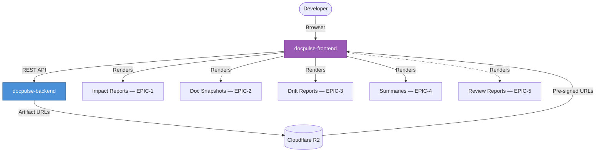

<div align="center">

# DocPulse Frontend

**Developer Intelligence Dashboard**

[](https://react.dev/)
[](https://www.typescriptlang.org/)
[](https://vitejs.dev/)
[](https://tailwindcss.com/)
[](https://playwright.dev/)
[](Dockerfile)

*Part of the [DocPulseAI](https://github.com/DocPulseAI) ecosystem — **Developer Dashboard***

---

**DocPulse Frontend** is a premium single-page application (SPA) that provides developers and platform administrators with an interactive dashboard to manage documentation pipelines, visualize repository architectures, track documentation health metrics, compare code-vs-doc drift, and edit templates — all powered by rich 3D visualizations, interactive graphs, and live code editing.

</div>

---

## Table of Contents

- [Purpose](#purpose)
- [Responsibilities](#responsibilities)
- [Architecture Overview](#architecture-overview)
- [Key Features](#key-features)
- [Technology Stack](#technology-stack)
- [Directory Structure](#directory-structure)
- [Environment Variables](#environment-variables)
- [Installation](#installation)
- [Local Development](#local-development)
- [Testing](#testing)
- [Docker](#docker)
- [CI/CD](#cicd)
- [Integration with DocPulseAI](#integration-with-docpulseai)
- [Deployment](#deployment)
- [Troubleshooting](#troubleshooting)
- [Roadmap](#roadmap)
- [Contributing](#contributing)

---

## Purpose

- **Business Purpose**: Provide developers and platform administrators with a premium, visually engaging dashboard to control and inspect their codebase documentation lifecycle, view impact reports, verify API structural changes, and resolve doc drift issues.
- **Technical Purpose**: Deliver a single-page application optimized for quick render cycles and visual excellence, leveraging TailwindCSS, interactive data visualizations (D3, React Flow, Recharts), and Monaco Editor to present live codebase insights.

---

## Responsibilities

| Domain | Description |
|---|---|
| **Dashboard & Project Controls** | UI controls to add, update, delete, and manually trigger EPIC documentation runs for code repositories. |
| **Interactive Visualizations** | Render 3D call graphs, visual dependency graphs, API schemas, and documentation health charts. |
| **Drift Comparison** | Display line-by-line diffs and semantic drift findings, enabling developers to resolve inconsistencies. |
| **Code Editing** | Integrated Monaco Editor for live template editing and documentation previewing. |
| **Diagnostics Tracing** | Automatically assign client-side logs to correlation identifiers (`X-Request-Id`) for end-to-end debugging. |

---

## Architecture Overview

The frontend communicates directly with the Express API server (`docpulse-backend`) using an Axios-based API client:

```mermaid
graph TD
    User([Developer / Maintainer]) -->|Interacts with UI| Frontend[docpulse-frontend]

    subgraph SPA — Vite + React
        Router[React Router v6] --> Pages[Dashboard / Projects / Admin]
        Pages --> Store[Redux Toolkit State]
        Pages --> Flow[React Flow / D3 Graphs]
        Pages --> ThreeD[Three.js 3D Renderer]
        Pages --> Editor[Monaco Editor Templates]
        Store --> APIClient[Axios Client + X-Request-Id]
    end

    APIClient -->|HTTP REST| Backend[docpulse-backend]

    style Frontend fill:#9B59B6,stroke:#7D3C98,color:#fff
    style Backend fill:#4A90D9,stroke:#2C5F8A,color:#fff
```

Outbound requests are handled via `src/services/api.ts`, which injects authentication tokens and generates unique request correlation headers.

---

## Key Features

| Feature | Technology | Description |
|---|---|---|
| **Architecture Diagrams** | React Flow + Dagre | Interactive node-edge diagrams showing codebase module relationships |
| **3D Call Graphs** | Three.js + React Three Fiber | Immersive 3D visualizations of function call hierarchies |
| **Metrics Charts** | Recharts | Documentation health scores, complexity trends, drift severity distribution |
| **Particle Backgrounds** | tsParticles | Dynamic animated backgrounds for premium visual experience |
| **Live Code Editor** | Monaco Editor | Syntax-highlighted template editing with IntelliSense |
| **Diff Viewer** | Custom React components | Side-by-side code-vs-documentation drift comparison |
| **Mermaid Rendering** | Mermaid.js | Render architecture and sequence diagrams from generated documentation |
| **Command Palette** | cmdk | Keyboard-driven command palette for power users |
| **Fuzzy Search** | Fuse.js | Fast client-side fuzzy search across projects and artifacts |

---

## Technology Stack

| Category | Technology | Version | Purpose |
|---|---|---|---|
| **Bundler** | Vite | 5.0.10 | Ultra-fast HMR and optimized production builds |
| **Framework** | React | 18.2.0 | Component-based UI framework |
| **Language** | TypeScript | 5.3.3 | Type-safe frontend development |
| **State** | Redux Toolkit | 2.0.1 | Predictable global state management |
| **Styling** | TailwindCSS | 4.2.1 | Utility-first CSS framework |
| **Routing** | React Router DOM | 6.21.1 | Client-side routing and navigation |
| **Graphs** | React Flow + Dagre | 11.11.4 | Interactive node-edge architecture diagrams |
| **Charts** | Recharts | 3.7.0 | Data visualization and metrics charts |
| **3D** | Three.js + React Three Fiber | 0.182 / 8.17 | 3D graphic rendering and call graph visualization |
| **Data Viz** | D3.js | 7.9.0 | Custom layouts and advanced visualizations |
| **Editor** | Monaco Editor | 4.7.0 | Code editing with syntax highlighting |
| **Animation** | Framer Motion | 12.34.0 | Smooth transitions and micro-animations |
| **HTTP** | Axios | 1.6.2 | HTTP client with interceptors |
| **Search** | Fuse.js | 7.1.0 | Client-side fuzzy search |
| **UI Primitives** | Radix UI | Latest | Accessible, unstyled component primitives |
| **Unit Testing** | Vitest + Testing Library | 4.0.18 / 16.3.0 | Component and hook testing |
| **E2E Testing** | Playwright | 1.58.2 | Cross-browser end-to-end testing |

---

## Directory Structure

```
docpulse-frontend/
├── dist/                   # Production build output (HTML/JS/CSS assets)
├── public/                 # Static assets (icons, logo)
├── src/                    # Source code
│   ├── assets/             # Static SVGs, images, fonts
│   ├── components/         # Reusable design components (buttons, modals, forms)
│   ├── context/            # React context providers (Auth, theme settings)
│   ├── design-system/      # Token designs, color systems, HSL variables
│   ├── hooks/              # Custom hooks (useAuth, useFetch, useDebounce)
│   ├── pages/              # Main view screens (Dashboard, ProjectSettings, APIViewer)
│   ├── services/           # Axios HTTP endpoint clients (api.ts, intelligence.ts)
│   ├── store/              # Redux slices and state selectors
│   ├── styles/             # Global CSS declarations, TailwindCSS base configs
│   ├── types/              # TypeScript typings and interfaces
│   ├── utils/              # Helper functions and formatters
│   ├── App.tsx             # Main routing shell
│   ├── main.tsx            # DOM mounting entrypoint
│   └── vite-env.d.ts       # Vite environment types
├── tests/                  # Playwright E2E test scripts
├── nginx.conf              # Nginx server configuration for static serving
├── index.html              # SPA HTML entrypoint
├── playwright.config.ts    # Playwright E2E configuration
├── vite.config.ts          # Vite build configuration
├── vitest.config.ts        # Vitest unit testing configuration
├── Dockerfile              # Production container definition
└── package.json            # Node.js dependency manifest
```

---

## Environment Variables

Vite embeds environment variables prefixed with `VITE_` at compile time.

| Variable | Purpose | Required | Default |
|---|---|---|---|
| `VITE_API_URL` | Target URL of the main backend | **Yes** | `https://api.docpulse.ai` |
| `VITE_API_BASE` | Path prefix fallback for API routing | No | `/api` |
| `VITE_API_HOSTPORT` | Hostport for endpoint resolution | No | `localhost:8000` |
| `VITE_EPIC5_API` | Target path prefix for review engine routes | No | `/api` |
| `VITE_ENABLE_DIAGNOSTICS_LOGS` | Toggle detailed client logging | No | `true` (dev) / `false` (prod) |
| `VITE_API_LOG_BODY_MAX_CHARS` | Cap print size of payloads in logs | No | `1200` |

---

## Installation

### Prerequisites

- Node.js v20.x
- npm v10.x

### Setup

```bash
# Navigate to the frontend directory
cd docpulse-frontend

# Install dependencies
npm install
```

---

## Local Development

```bash
# Start Vite dev server with HMR
npm run dev
```

The application will be available at [http://localhost:5173](http://localhost:5173).

```bash
# Build production bundle
npm run build

# Preview the production build locally
npm run preview
```

---

## Testing

### Unit Tests

Built with **Vitest** and **Testing Library**:

```bash
npm run test:unit
```

### End-to-End Tests

Built with **Playwright** — tests target real browsers and verify auth flows, project creation, and routing:

```bash
# Run headlessly
npm run test:e2e

# Run with interactive UI mode
npm run test:e2e:ui
```

---

## Docker

```bash
# Build image (VITE_API_URL is embedded at compile time)
docker build --build-arg VITE_API_URL="https://api.docpulse.ai" -t docpulse-frontend .

# Run container
docker run -p 80:80 docpulse-frontend
```

> **Note**: Since Vite embeds environment variables during compilation, you must supply `--build-arg` values during `docker build`. Runtime `ENV` variables in the container will not take effect.

---

## CI/CD


| Workflow | Trigger | Purpose |
|---|---|---|
| `ci.yml` | Push / PR | Lint, typecheck, unit tests, build verification |
| `security.yml` | Push / PR | Dependency vulnerability scanning |

---

## Integration with DocPulseAI

The frontend is the **user-facing layer** of the entire DocPulseAI platform:



| Data Source | Visualization |
|---|---|
| **EPIC-1 (Code Intelligence)** | Interactive AST diff viewers, function change lists, complexity charts |
| **EPIC-2 (Doc Generation)** | Rendered Markdown documentation, Mermaid architecture diagrams |
| **EPIC-3 (Drift Detection)** | Side-by-side code-vs-doc drift comparisons with severity indicators |
| **EPIC-4 (Impact Summary)** | Human-readable change summaries, risk indices, recommended actions |
| **EPIC-5 (Review Engine)** | PR review reports with severity distribution and fix suggestions |

---

## Deployment

The frontend compiles to static assets (HTML, CSS, JS) served inside a lightweight Nginx container.

- **Nginx Configuration** (`nginx.conf`): Optimized for SPA routing — redirects all sub-paths to `index.html` to prevent 404 errors on refresh.
- **Deployment targets**: Render, Vercel, or any platform supporting static file hosting or container runners.

---

## Troubleshooting

### API Requests Returning Incorrect Origin
- **Symptom**: Outbound requests fail or target the wrong domain.
- **Solution**: Check `VITE_API_URL` during the Docker build stage. Since Vite embeds variables at compile time, you must supply `--build-arg VITE_API_URL=...` during `docker build`.

### Outbound API Traces
- **Symptom**: Backend API errors occur and need frontend context.
- **Solution**: Enable `VITE_ENABLE_DIAGNOSTICS_LOGS=true` to inspect client-side network diagnostics. Locate lifecycle logs in the browser console:
  - `FRONTEND_API_REQUEST_START`
  - `FRONTEND_API_REQUEST_SUCCESS`
  - `FRONTEND_API_REQUEST_FAILED`
  
  Match the `X-Request-Id` header value against backend container logs.

---

## Roadmap

| Phase | Feature | Status |
|---|---|---|
| **v1.0** | Core dashboard with project management and pipeline triggers | ✅ Complete |
| **v1.0** | React Flow architecture diagrams | ✅ Complete |
| **v1.0** | Monaco Editor template editing | ✅ Complete |
| **v1.0** | Drift comparison viewer | ✅ Complete |
| **v1.1** | EPIC-5 Review Engine dashboard integration | 🔨 In Progress |
| **v1.1** | 3D call graph visualizations with Three.js | 🔨 In Progress |
| **v1.2** | Real-time pipeline progress via WebSocket | 📋 Planned |
| **v1.2** | Dark mode theme system | 📋 Planned |
| **v2.0** | Collaborative documentation editing | 📋 Planned |
| **v2.0** | AI-powered natural language search across artifacts | 📋 Planned |

---

## Contributing

1. Branches should branch from `develop`.
2. Format layout using CSS tokens defined in `src/design-system/` to preserve a premium visual style.
3. Ensure unit tests pass before submitting your Pull Request.
